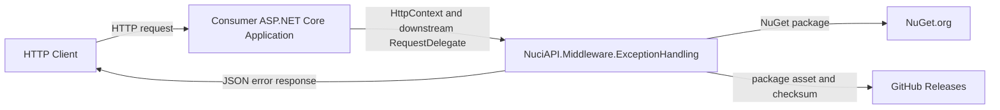
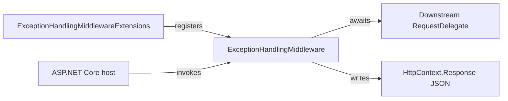
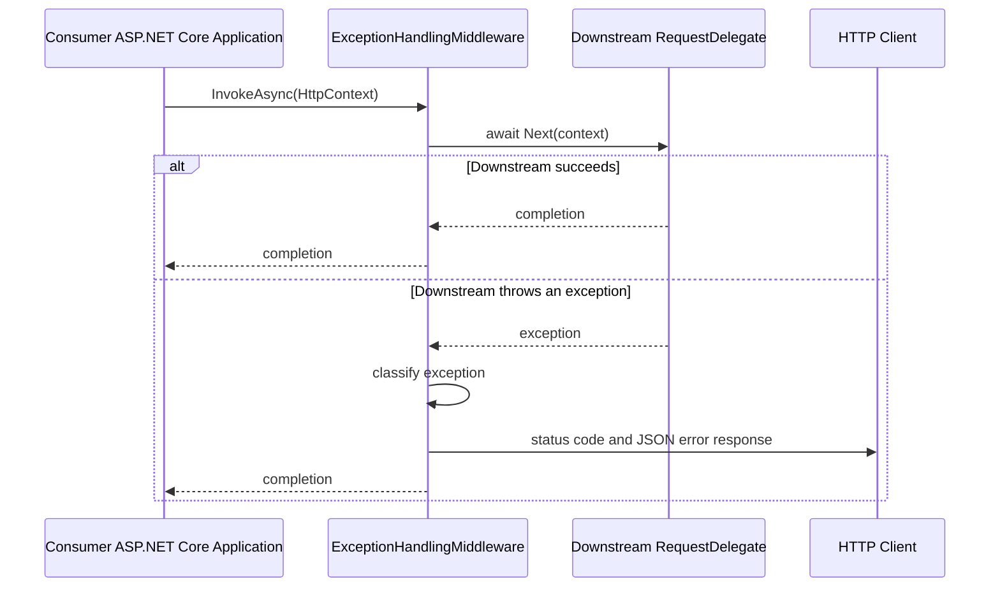
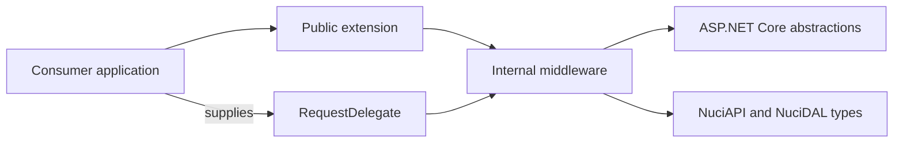

# NuciAPI.Middleware.ExceptionHandling Architecture

This document describes the current architecture of the NuciAPI.Middleware.ExceptionHandling library. It covers the package boundary, ASP.NET Core pipeline integration, error-response translation, distribution, and verification; the consuming application remains outside this repository's system boundary.

## 📑 Table of Contents

- [Purpose](#purpose)
- [System Context](#system-context)
- [Architectural Style](#architectural-style)
- [Runtime Flow](#runtime-flow)
- [Components](#components)
- [Data Architecture](#data-architecture)
- [Interfaces and Integrations](#interfaces-and-integrations)
- [Cross-Cutting Concerns](#cross-cutting-concerns)
  - [Error Handling](#error-handling)
  - [Concurrency and Resource Use](#concurrency-and-resource-use)
- [Dependency Direction and Rules](#dependency-direction-and-rules)
- [External Dependencies](#external-dependencies)
- [Deployment and Operations](#deployment-and-operations)
- [Compatibility Contracts](#compatibility-contracts)
- [Testing and Verification](#testing-and-verification)
- [Design Constraints](#design-constraints)
- [Source Map](#source-map)
- [Related Documentation](#related-documentation)

## 🎯 Purpose

The library converts selected exceptions from a downstream ASP.NET Core request pipeline into consistent JSON HTTP error responses. It is intended for application developers who compose NuciAPI-based services and for contributors who modify response semantics without disrupting the public registration or HTTP contracts.

## 🌐 System Context

The system boundary is a NuGet library hosted inside a consumer-owned ASP.NET Core application. The application registers the middleware and supplies the downstream `RequestDelegate`; the library observes exceptions from that delegate and writes an HTTP response through `HttpContext`. It neither hosts a process nor owns a database or persistent store. Incoming request data and downstream exception messages cross from the consuming application into the middleware, which therefore forms the response-translation boundary.



The principal external boundaries are:
- **Consumer ASP.NET Core application:** Registers the public extension method, owns request routing and the downstream delegate, and receives its `HttpContext` from the host runtime.
- **HTTP client:** Receives the status code and JSON error response produced when the downstream delegate throws a mapped exception.
- **NuGet.org and GitHub Releases:** Distribute the compiled library package; the release workflow uploads the package and its checksum to GitHub Releases.

## 🏗️ Architectural Style

This is a library-oriented ASP.NET Core middleware adapter. A public extension method provides the composition boundary, while an internal sealed middleware component implements the response-translation policy. The result is a narrow public surface: consuming applications select pipeline placement, and the package owns exception classification and response serialisation.



The principal architecture boundaries are:
- **Public composition API:** [`ExceptionHandlingMiddlewareExtensions.cs`](NuciAPI.Middleware.ExceptionHandling/ExceptionHandlingMiddlewareExtensions.cs) exposes pipeline registration and depends upon the internal middleware type.
- **Exception translation policy:** [`ExceptionHandlingMiddleware.cs`](NuciAPI.Middleware.ExceptionHandling/ExceptionHandlingMiddleware.cs) awaits the downstream delegate and owns exception classification and response generation.
- **Consumer application:** Supplies application routes, middleware order, and the downstream delegate; these concerns remain outside the package.

## 🔄 Runtime Flow



The principal runtime sequence is:
1. The consumer invokes `UseNuciApiExceptionHandling()` to register the middleware in its ASP.NET Core pipeline.
2. The host invokes `ExceptionHandlingMiddleware.InvokeAsync`, which awaits the supplied downstream delegate.
3. A successful delegate result completes unchanged; a recognised or unhandled exception is translated into a JSON response with an HTTP status code.

## 🧩 Components

| Component | Responsibility | Principal Dependencies | Lifetime or Ownership |
|-----------|----------------|------------------------|-----------------------|
| [`ExceptionHandlingMiddlewareExtensions`](NuciAPI.Middleware.ExceptionHandling/ExceptionHandlingMiddlewareExtensions.cs) | Registers the exception middleware through `IApplicationBuilder`. | ASP.NET Core middleware registration API | Public static composition API owned by this package |
| [`ExceptionHandlingMiddleware`](NuciAPI.Middleware.ExceptionHandling/ExceptionHandlingMiddleware.cs) | Awaits downstream execution, maps exceptions, and writes JSON HTTP error responses. | `RequestDelegate`, `HttpContext`, NuciAPI response and security types | Internal sealed middleware created by the ASP.NET Core middleware pipeline |

## 💾 Data Architecture

The package does not persist, cache, or migrate data. For exception paths, it transforms an in-memory exception into a `NuciApiErrorResponse`, sets the `HttpContext.Response` status and content type, and serialises the response as JSON. The consuming application and ASP.NET Core host own the request context and response stream lifecycle.


| Data or Store | Owner | Representation and Storage | Lifecycle or Consistency |
|---------------|-------|----------------------------|--------------------------|
| Exception response | `ExceptionHandlingMiddleware` during exception handling | `NuciApiErrorResponse` serialised to the ASP.NET Core response body | Created per handled exception; no package-owned retention |
| Request context and response body | Consumer host and ASP.NET Core | `HttpContext` and its response stream | Owned and disposed by the host runtime |

## 🔌 Interfaces and Integrations

| Interface or Integration | Direction | Contract | Owner | Failure Semantics |
|--------------------------|-----------|----------|-------|-------------------|
| `UseNuciApiExceptionHandling()` | Inbound | `IApplicationBuilder` extension method that registers the middleware | This package | Registration delegates construction to ASP.NET Core; ordering remains the consumer application's responsibility |
| ASP.NET Core request pipeline | Inbound and outbound | `RequestDelegate` and `HttpContext` | Consumer host | Downstream exceptions are mapped to a response by this package; successful processing passes through unchanged |
| NuGet.org | Outbound | NuGet package distribution | Package release process | Availability and installation are external to the runtime library |
| GitHub Releases | Outbound | Release asset upload and SHA256 publication | [`.github/workflows/github-release.yml`](.github/workflows/github-release.yml) | The release workflow packages the current release tag version and uploads the `.nupkg` asset |

## 🧵 Cross-Cutting Concerns

### Error Handling

[`ExceptionHandlingMiddleware`](NuciAPI.Middleware.ExceptionHandling/ExceptionHandlingMiddleware.cs) owns exception translation for its downstream segment of the pipeline. It maps recognised exception categories to HTTP status codes and predefined NuciAPI response values; all other exceptions result in a 500 response. It sets `Content-Type` to `application/json` before writing the response. Exceptions occurring before this middleware, after a response has begun, or outside the consumer's registered pipeline are not handled by this component.

### Concurrency and Resource Use

Each invocation is asynchronous and awaits its own downstream `RequestDelegate`. The middleware maintains no mutable shared state, cache, queue, or background worker. Request concurrency, cancellation behaviour outside the mapped `OperationCanceledException` response, and response-stream capacity remain responsibilities of the ASP.NET Core host and consumer application.

## 🧭 Dependency Direction and Rules

The public extension depends inward on the internal middleware implementation; the middleware depends on ASP.NET Core abstractions and NuciAPI/NuciDAL response and exception types. Neither component depends on consumer application code beyond the supplied `RequestDelegate` and `HttpContext` abstractions.



The principal dependency rules are:
- Public registration remains in [`ExceptionHandlingMiddlewareExtensions.cs`](NuciAPI.Middleware.ExceptionHandling/ExceptionHandlingMiddlewareExtensions.cs); exception classification remains in [`ExceptionHandlingMiddleware.cs`](NuciAPI.Middleware.ExceptionHandling/ExceptionHandlingMiddleware.cs).
- The library may depend upon ASP.NET Core and declared NuGet package contracts, but it must not depend upon routes, persistence, or configuration owned by a consumer application.
- Consumer middleware order is external configuration; this package must not impose application routing or host lifecycle behaviour.

## 📦 External Dependencies

| Dependency | Responsibility | Integration Boundary | Architectural Consequence |
|------------|----------------|----------------------|---------------------------|
| `Microsoft.AspNetCore.App` | Supplies `IApplicationBuilder`, `RequestDelegate`, `HttpContext`, and JSON response writing. | Middleware registration and invocation | The library is constrained to ASP.NET Core applications supporting `net10.0`. |
| `NuciAPI.Middleware` | Supplies the `NuciApiMiddleware` base class. | [`ExceptionHandlingMiddleware.cs`](NuciAPI.Middleware.ExceptionHandling/ExceptionHandlingMiddleware.cs) | Middleware lifecycle and downstream delegation conform to the base class contract. |
| `NuciAPI.Middleware.Security` and `NuciDAL` | Supply exception types that participate in status mapping. | [`ExceptionHandlingMiddleware.cs`](NuciAPI.Middleware.ExceptionHandling/ExceptionHandlingMiddleware.cs) | Changes to those exception contracts can alter the mapped response surface. |
| `NuciAPI.Responses` | Supplies error response models and codes. | [`ExceptionHandlingMiddleware.cs`](NuciAPI.Middleware.ExceptionHandling/ExceptionHandlingMiddleware.cs) | Response shape and codes are governed by the referenced package types. |

## 🚀 Deployment and Operations

The deployment unit is a `net10.0` NuGet library, not an independently executable process. Consumer applications restore and register the package; their process topology, scaling, startup, shutdown, and network exposure remain external. The repository's published-release workflow packs the solution and uploads the generated package asset to GitHub Releases with a SHA256 checksum.

| Concern | Current Design | Architectural Consequence |
|---------|----------------|---------------------------|
| Process topology | Library loaded into a consumer-owned ASP.NET Core process | No standalone service configuration, listener, or lifecycle exists in this repository |
| Persistent state | No package-owned persistence or cache | Scaling and recovery are determined by the consumer host |
| Release distribution | [`.github/workflows/github-release.yml`](.github/workflows/github-release.yml) creates and uploads a versioned NuGet package | Release tags must resolve to the intended package version |

## 🛡️ Compatibility Contracts

| Contract | Owner | Invariant | Verification | Change Policy |
|----------|-------|-----------|--------------|---------------|
| Middleware registration API | [`ExceptionHandlingMiddlewareExtensions.cs`](NuciAPI.Middleware.ExceptionHandling/ExceptionHandlingMiddlewareExtensions.cs) | `UseNuciApiExceptionHandling()` remains an `IApplicationBuilder` extension that registers this middleware | Consumer compilation and manual pipeline integration | Preserve the signature or introduce a compatible alternative before removal |
| Exception-to-response mapping | [`ExceptionHandlingMiddleware.cs`](NuciAPI.Middleware.ExceptionHandling/ExceptionHandlingMiddleware.cs) | Mapped exception categories produce their defined HTTP status codes and JSON response content type | [`ExceptionHandlingMiddlewareTests.cs`](NuciAPI.Middleware.ExceptionHandling.UnitTests/ExceptionHandlingMiddlewareTests.cs) | Treat status and response changes as consumer-visible compatibility changes |

## ✅ Testing and Verification

The NUnit project [`NuciAPI.Middleware.ExceptionHandling.UnitTests`](NuciAPI.Middleware.ExceptionHandling.UnitTests) uses `InternalsVisibleTo` access to instantiate the internal middleware directly. It verifies mapped status codes, JSON response content, and delegation without an exception. CI restores, builds, and tests the solution on pushes and pull requests to `master` through [`.github/workflows/dotnet.yml`](.github/workflows/dotnet.yml). The repository does not contain an integration test that verifies consumer pipeline ordering or external package publication.

Execute the principal automated verification with:

```bash
dotnet test NuciAPI.Middleware.ExceptionHandling.sln
```

## ⚠️ Design Constraints

- **Consumer-Owned Pipeline Order:** The consuming application determines where the middleware executes, which determines the downstream exceptions it can translate.
- **No Persistent State:** The package only writes the active HTTP response and provides no store, cache, retry mechanism, or background recovery process.
- **Exception Coverage:** Only the exception categories enumerated in [`ExceptionHandlingMiddleware.cs`](NuciAPI.Middleware.ExceptionHandling/ExceptionHandlingMiddleware.cs) receive specialised responses; every other exception receives the generic internal-server-error response.
- **Framework Target:** The package targets `net10.0` and relies on ASP.NET Core framework APIs available to that target.

## 🗺️ Source Map

| Area | Path |
|------|------|
| Library implementation | [`NuciAPI.Middleware.ExceptionHandling`](NuciAPI.Middleware.ExceptionHandling) |
| Unit tests | [`NuciAPI.Middleware.ExceptionHandling.UnitTests`](NuciAPI.Middleware.ExceptionHandling.UnitTests) |
| Continuous integration and release automation | [`.github/workflows`](.github/workflows) |
| Package and test composition | [`NuciAPI.Middleware.ExceptionHandling.sln`](NuciAPI.Middleware.ExceptionHandling.sln) |

## 📚 Related Documentation

- [README.md](README.md) provides installation, usage, exception mapping, and development commands.
- [SECURITY.md](SECURITY.md) defines vulnerability reporting scope and coordinated disclosure.